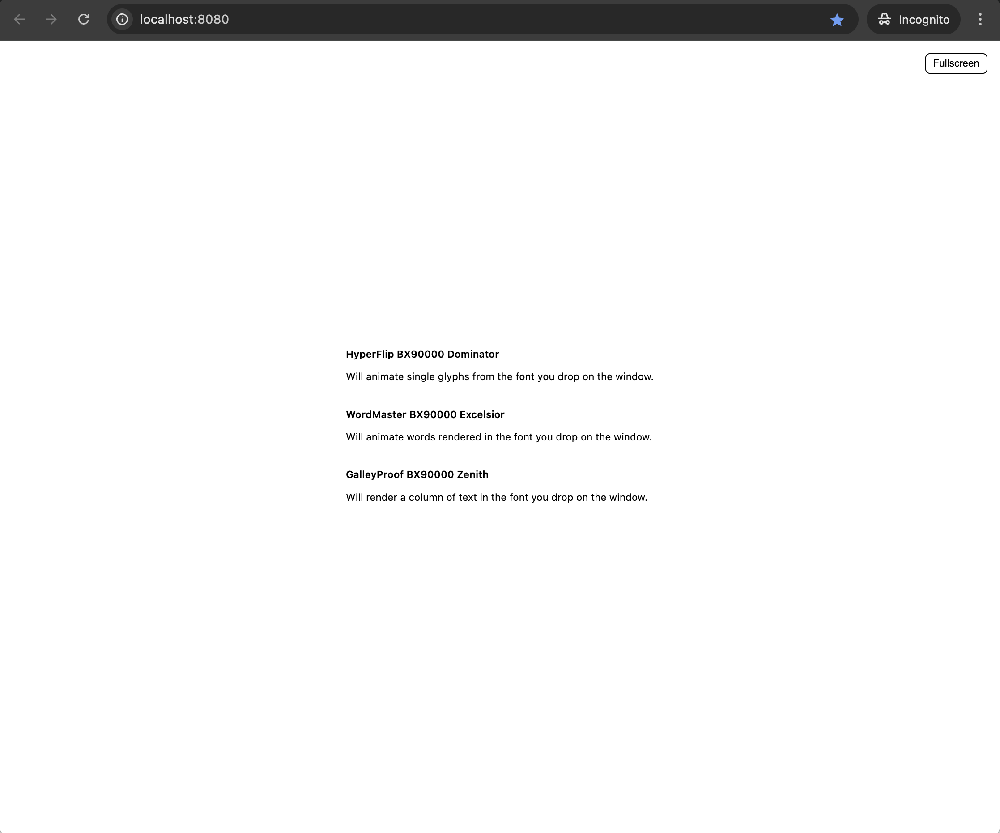
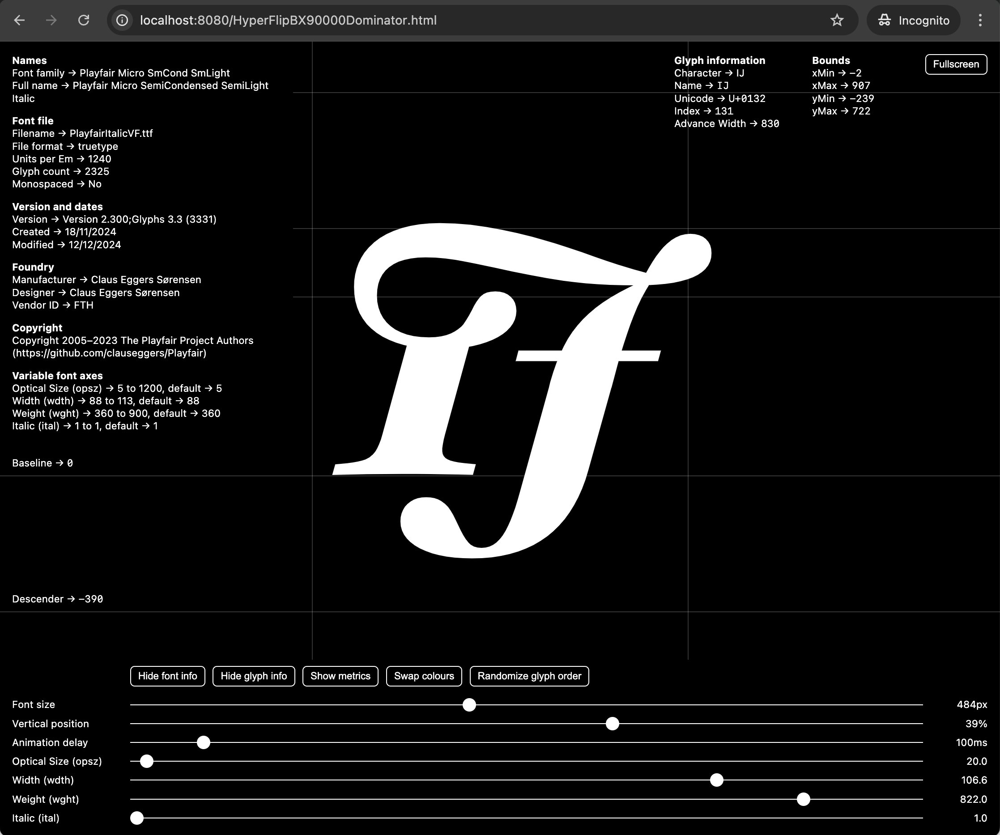
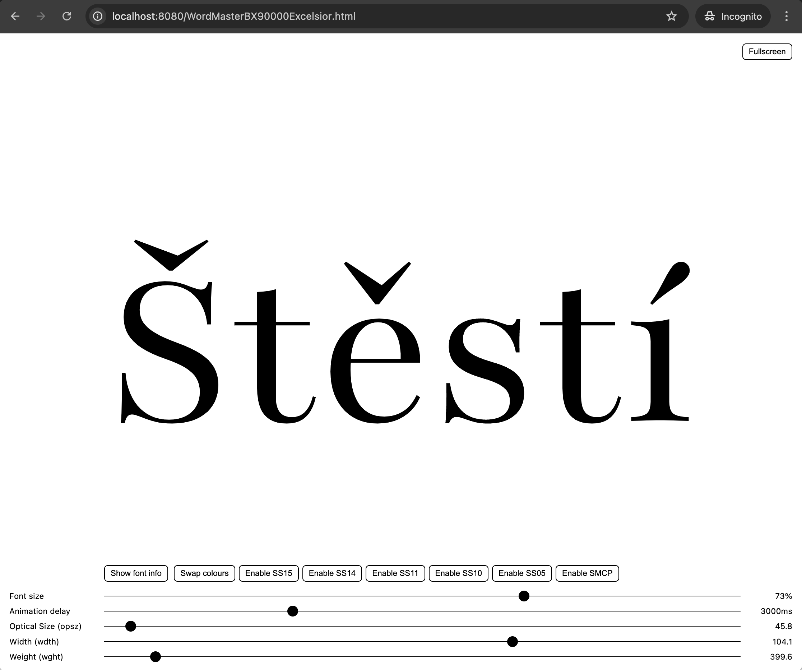
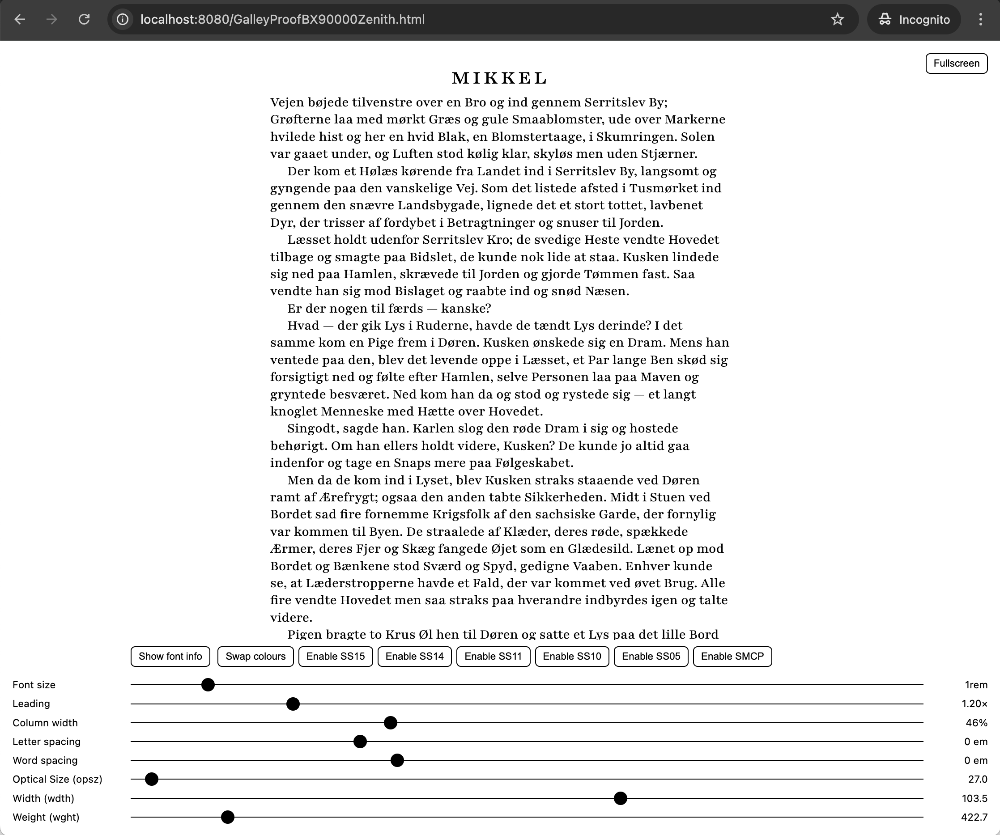

# The BX90000 Font Presenter Super Suite
This is a collection of three webpages that enables you to present fonts in three different ways.

## HyperFlip BX90000 Dominator
Will animate single glyphs from the font you drop on the window.

## WordMaster BX90000 Excelsior
Will animate words rendered in the font you drop on the window.

## GalleyProof BX90000 Zenith
Will render a column of text in the font you drop on the window.

## License
Like the included `opentype.js` this software is licensed under the MIT license.

## Requirements
These pages needs to be served with the `http_server` webserver component from Node, so this must be installed before using these pages. The `serve.sh` script will detect and alert you if this component is not installed.

The `serve.sh` and `serve.bat` scripts are configured to find and use the Chrome browser.

##  How to use the BX90000 Font Presenter Super Suite
Execute the `serve.sh` (Linux or MacOS) or `serve.bat` (Windows). These scripts will check for the presence of the `http_server`, warn you if it isn’t installed, otherwise proceed with detecting your operating system, finding the Chrome executable, and open the `index.html` in an Incognito window.

Click on one of the three options.

## HyperFlip BX90000 Dominator
Will animate single glyphs from the font you drop on the window.

### Options
- Fullscreen mode (press the `Fullscreen` button or press your `f` key)
- Pause/continue the glyph animation by pressing your `space` key
- Jump ten glyphs forward by pressing the `l` or `▶︎` key
- Jump one glyph forward by pressing the `k` or `▲` key
- Jump ten glyphs backwards by pressing the `h` or `◀︎` key
- Jump one glyph backwards by pressing the `j` or `▼` key

The page has a control panel that will appear when you hover the mouse over the bottom of the page
- Show font info
- Show glyph info
- Show a metrics grid overlay
- Swap colours
- Randomise glyph order
- Adjust the font size
- Adjust the vertical position
- Adjust the animation delay
- Adjust the Variable Font axes settings (these will only appear if the font contains variable font axes)

## WordMaster BX90000 Excelsior
Will animate words rendered in the font you drop on the window.

### Options
- Fullscreen mode (press the `Fullscreen` button or press your `f` key)
- Pause/continue the glyph animation by pressing your `space` key

The page has a control panel that will appear when you hover the mouse over the bottom of the page
- Show font info
- Swap colours
- Toggle Stylistic Alternates and small-caps
- Adjust the font size
- Adjust the animation delay
- Adjust the Variable Font axes settings (these will only appear if the font contains variable font axes)

## GalleyProof BX90000 Zenith
Will render a column of text in the font you drop on the window.

### Options
- Fullscreen mode (press the `Fullscreen` button or press your `f` key)

The page has a control panel that will appear when you hover the mouse over the bottom of the page
- Show font info
- Swap colours
- Toggle Stylistic Alternates and small-caps
- Adjust the font size
- Adjust the leading
- Adjust the column width
- Adjust the letter spacing
- Adjust the word spacing
- Adjust the Variable Font axes settings (these will only appear if the font contains variable font axes)