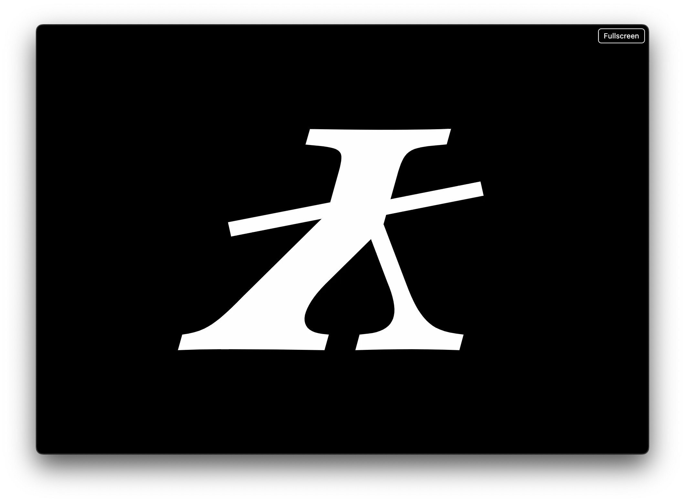

# HyperFlipBX90000Dominator
A stand-alone webpage that flips through the glyphs of a font. The page uses `opentype.js` to achieve this, it is in the header so no internet connection is needed.

# How to use the HyperFlip BX 90000 Dominator
Open the HTML page in a browser.

**HyperFlipBX90000Dominator** will display the most common axes present in your font, if your font is variable

The control panel will become invisible when you move out your mouse cursor.

If you like a negative rendering there is button for that.

In the upper right corner there is a `Fullscreen` button. It full-screens **HyperFlipBX90000Dominator**.

In the control panel there is a `Randomize glyph order` button. It randomises the glyph order. Press it again and it reverts to sequential glyph order.

Once you have found a setting you like you can let it animate.
