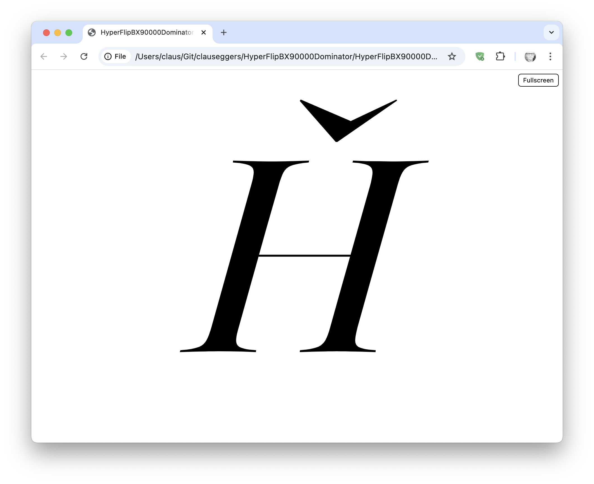
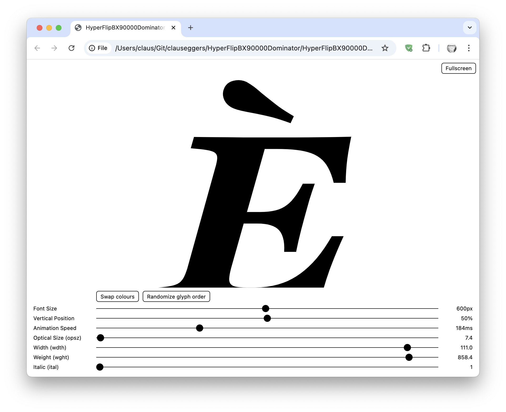
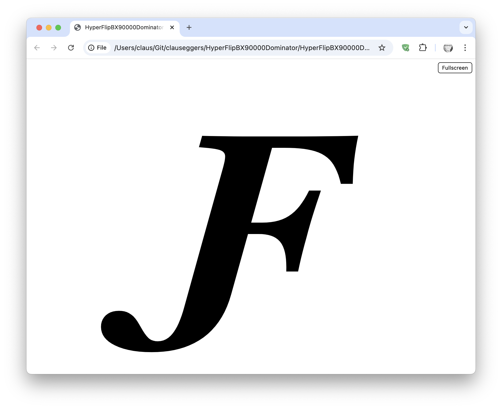
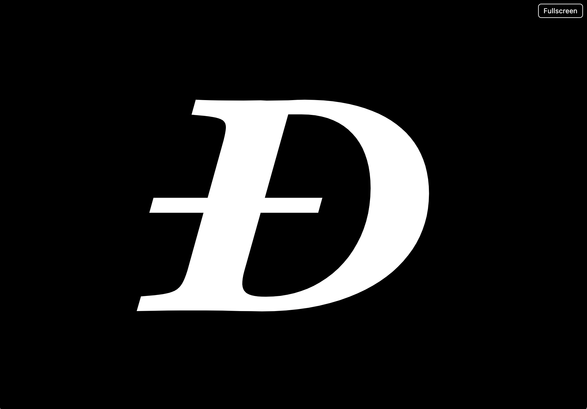
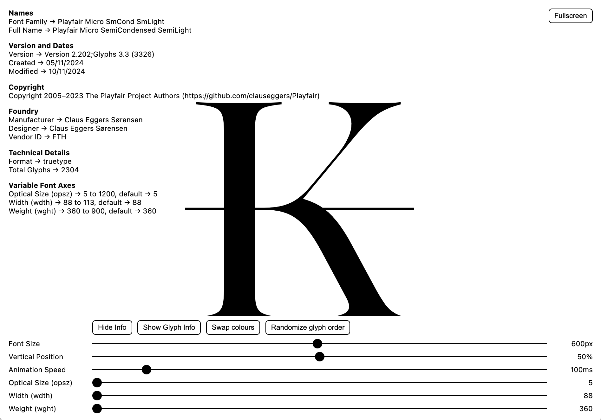
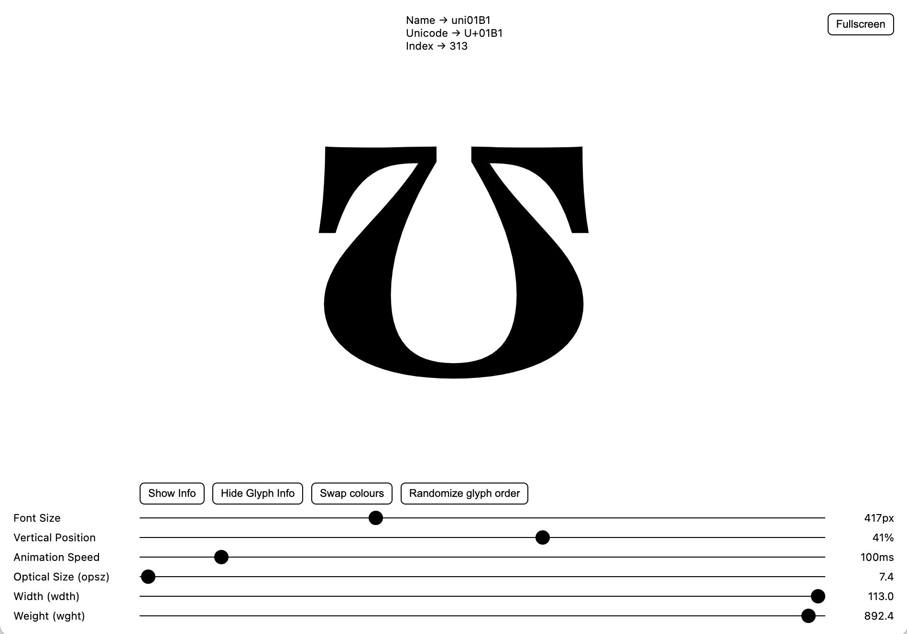

# HyperFlipBX90000Dominator
A stand-alone webpage that flips through the glyphs of a font. The page uses `opentype.js` to achieve this, it is in the header so no internet connection is needed.

## License
Like the included `opentype.js` this software is licensed under the MIT license.

##  How to use the HyperFlip BX 90000 Dominator
Open the HTML page in a browser and drop a font on it. It will read OTF or TTF, static and variable.

## Keyboard shortcuts
Pressing the `Space` key on your keyboard pauses/resumes the animation. Pressing either `arrow left` or `h` moves ten glyphs back, and pressing either `arrow right` or `l` moves ten glyphs forward. Pressing either `arrow up` or `k` moves one glyph forward, and pressing either `arrow down` or `j` will move one glyph back.

**HyperFlipBX90000Dominator** will display the most common axes present in your font, if your font is variable.

The control panel will become invisible when you move out your mouse cursor.

If you like a negative rendering there is button for that.

If you want to see some information about the font there is a button for that.

If you want to see some information about the currently displayed glyph there is a button for that.

In the upper right corner there is a `Fullscreen` button. It full-screens **HyperFlipBX90000Dominator**.

In the control panel there is a `Randomize glyph order` button. It randomises the glyph order. Press it again and it reverts to sequential glyph order.

Once you have found a setting you like you can let it animate.

Yes I will be accepting pull requests. Don’t ask me for new features, make them yourself and pull request me.